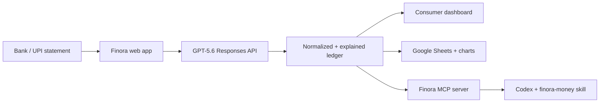

# Finora

**Statement in. Money story out.** Finora turns bank, card, and UPI statements into an explainable ledger, useful spending insights, a polished Google Sheets report, and a financial memory that agents can query through MCP.

Built for **OpenAI Build Week 2026 — Apps for your life**.

## Why this can win

Most expense trackers start after the work: users must connect a supported bank, fix a brittle CSV, or label every payment. Finora starts with the artifact everyone already has — a statement. GPT-5.6 reads native or scanned PDFs across inconsistent bank formats, normalizes messy UPI narrations, and explains every category. Corrections remain visible and agent-safe.

The result is not trapped in one UI. It becomes:

- a fast consumer money snapshot;
- a clean transaction ledger with confidence and evidence;
- a Google Sheet with category rollups and charts;
- an MCP server and reusable Codex skill.

## Run the demo

Requirements: Node.js 22.13+.

```bash
npm install
copy .env.example .env.local
npm run dev
```

Open the printed local URL. The app starts with realistic demo data. Upload [`samples/upi-statement.csv`](samples/upi-statement.csv) to exercise the complete no-key path.

Add `OPENAI_API_KEY` to `.env.local` to enable GPT-5.6 parsing for PDFs, scanned statements, screenshots, and unfamiliar formats. The default model is `gpt-5.6` and can be changed with `OPENAI_MODEL`.

## Google sign-in and weekly Gmail reports

Finora uses Better Auth with Google OAuth. A signed-in user's corrected ledger, budgets, and report preference are stored in D1 under that user's ID. Gmail access is requested separately and only when the user enables the Sunday report; the requested scope can send mail but cannot read the inbox.

### Credentials to add

```env
BETTER_AUTH_SECRET=generate-a-random-32-byte-secret
BETTER_AUTH_URL=http://localhost:3000
GOOGLE_CLIENT_ID=your-web-oauth-client.apps.googleusercontent.com
GOOGLE_CLIENT_SECRET=your-google-oauth-client-secret
CRON_SECRET=another-long-random-secret
```

Create them step by step:

1. Generate the two secrets. In PowerShell, run `node -e "console.log(require('crypto').randomBytes(32).toString('base64url'))"` twice. Use one value for `BETTER_AUTH_SECRET` and the other for `CRON_SECRET`.
2. Open [Google Cloud Console](https://console.cloud.google.com/), create or select a project, then open **APIs & Services → Library** and enable **Gmail API**.
3. Open **Google Auth Platform → Branding**, configure the app name, support email, and developer contact. For hackathon testing, keep the app in testing and add each judge/demo Google account under **Audience → Test users**.
4. Under **Data Access**, add the basic identity scopes (`openid`, `.../auth/userinfo.email`, `.../auth/userinfo.profile`) and `https://www.googleapis.com/auth/gmail.send`. A public production launch may require Google's OAuth verification for the Gmail scope.
5. Open **Clients → Create client → Web application**. Add `http://localhost:3000` as an authorized JavaScript origin.
6. Add `http://localhost:3000/api/auth/callback/google` as an authorized redirect URI. For the deployed site, also add `https://YOUR-DOMAIN/api/auth/callback/google` and use `https://YOUR-DOMAIN` for `BETTER_AUTH_URL` in that environment.
7. Copy the client ID and client secret into `.env.local`, run `npm run db:migrate:local` once, then restart `npm run dev`.

Google only returns a durable refresh token during an offline consent flow. Finora configures Better Auth with `accessType: "offline"` and a consent prompt, and Better Auth encrypts OAuth tokens before storing them.

### Run weekly delivery

`POST /api/reports/weekly` is protected by `CRON_SECRET`. The included Worker scheduler invokes it hourly; Finora sends at 8:00 AM Sunday in each opted-in user's timezone and suppresses repeat sends for six days. To test immediately:

```powershell
Invoke-RestMethod -Method Post -Headers @{ Authorization = "Bearer $env:CRON_SECRET" } -Uri "http://localhost:3000/api/reports/weekly?force=1"
```

The D1 schema and migration are in [`db/schema.ts`](db/schema.ts) and [`drizzle/0000_icy_thena.sql`](drizzle/0000_icy_thena.sql).

## Use it from Codex through MCP

The repository includes `.codex/config.toml`; from this project, restart Codex so the `finora` MCP server is discovered. Or add it manually:

```bash
codex mcp add finora -- node mcp/server.mjs
```

The MCP server is the product surface: agents can chain focused tools without triggering unwanted side effects.

| Stage | Tools |
| --- | --- |
| Extract | `parse_statement` |
| Clean and classify | `normalize_merchants`, `categorize_transactions` |
| Review and persist | `save_transactions`, `correct_category`, `search_transactions` |
| Understand | `summarize_transactions`, `monthly_summary`, `merchant_analysis`, `spending_trends`, `compare_months`, `answer_finance_question` |
| Protect | `detect_subscriptions`, `find_duplicate_transactions`, `detect_spending_anomalies`, `budget_status`, `financial_health_score` |
| Export | `sync_to_sheet`, `export_sheet` |

`import_statement`, `get_spending_summary`, `list_transactions`, and `sync_to_google_sheets` remain as backward-compatible convenience tools.

The agent workflow lives in [`skills/finora-money/SKILL.md`](skills/finora-money/SKILL.md).

## Connect Google Sheets

1. Create a Google Sheet and open **Extensions → Apps Script**.
2. Paste [`integrations/google-sheets/Code.gs`](integrations/google-sheets/Code.gs).
3. Deploy it as a web app that runs as you. Optionally set `FINORA_SECRET` first.
4. In Finora, choose **Sync Sheets**, paste the deployed URL and matching secret.

Finora creates seven tabs: Finora Summary, Transactions, Monthly Summary, Category Summary, Merchant Summary, Subscriptions, and Pivot Analysis. It also builds category and month comparison charts. Your banking data goes only to your OpenAI project and the Apps Script URL you provide.

## Advanced intelligence

- Merchant normalization across noisy bank and UPI narrations
- Monthly comparisons and category-level change detection
- Subscription cadence, estimated renewal, and annualized cost
- Same-merchant, same-amount duplicate detection within two minutes
- New high-value merchant and category-jump anomalies
- Editable budgets with 80% warnings and over-budget states
- Transparent financial health score with a four-part breakdown
- Weekly spending report and natural-language ledger questions
- Receipt image intake and CSV, Excel, JSON, Markdown, and Sheets exports

## Architecture



The web endpoint uses Responses API file inputs for PDFs/images and Structured Outputs for a strict ledger schema. CSV/XLSX is converted to text; without a key, CSV uses a deterministic parser and transparent lower confidence.

## Privacy and safety

- No statement content is logged.
- API keys stay server-side.
- Raw uploads are processed in-request and are not persisted by the web demo.
- Signed-in users explicitly persist only the normalized ledger and budgets; raw statement files are never stored.
- Better Auth encrypts Google access and refresh tokens at rest in D1.
- MCP data is local in `.finora/ledger.json`.
- Confidence and explanations are first-class; the UI never hides uncertainty.
- Finora is an information tool, not financial, investment, tax, or legal advice.

## Hackathon demo in 150 seconds

1. **0:00–0:20** — Problem: bank exports are messy and trackers support only a subset of banks.
2. **0:20–0:55** — Drop a scanned or sample statement; show GPT-5.6 normalizing merchants and explaining categories.
3. **0:55–1:20** — Correct one low-confidence transfer; show totals and “safe to spend” update.
4. **1:20–1:45** — Sync to Google Sheets; open the generated summary and chart.
5. **1:45–2:20** — In Codex, ask “What can I safely spend?” through the Finora skill and MCP tools.
6. **2:20–2:30** — Close: one financial memory, useful everywhere.

## OpenAI Build Week

Codex accelerated the complete product loop: product framing against the judging rubric, UI implementation, API schema design, MCP tool ergonomics, the reusable skill, and verification. GPT-5.6 is part of the product itself: multimodal statement understanding, merchant normalization, category reasoning, confidence, and grounded insights.

License: MIT (add your chosen copyright holder before publishing).
