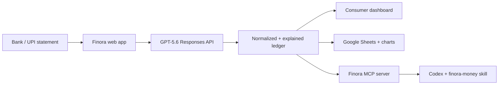

# Finora

**Statement in. Money story out.** Finora turns bank, card, and UPI statements into an explainable ledger, useful spending insights, a polished Google Sheets report, and a financial memory that agents can query through MCP.

Built for **OpenAI Build Week 2026 — Apps for your life**.

## Why this can win

Most expense trackers start after the work: users must connect a supported bank, fix a brittle CSV, or label every payment. Finora starts with the artifact everyone already has — a statement. GPT-5.6 reads native or scanned PDFs across inconsistent bank formats, normalizes messy UPI narrations, and explains every category. Corrections remain visible and agent-safe.

The result is not trapped in one UI. It becomes:

- a fast consumer money snapshot;
- a clean transaction ledger with confidence and evidence;
- a Google Sheet with category rollups and charts;
- an MCP server and reusable Codex skill.

## Run the demo

Requirements: Node.js 22.13+.

```bash
npm install
copy .env.example .env.local
npm run dev
```

Open the printed local URL. The app starts with realistic demo data. Upload [`samples/upi-statement.csv`](samples/upi-statement.csv) to exercise the complete no-key path.

Add `OPENAI_API_KEY` to `.env.local` to enable GPT-5.6 parsing for PDFs, scanned statements, screenshots, and unfamiliar formats. The default model is `gpt-5.6` and can be changed with `OPENAI_MODEL`.

## Use it from Codex through MCP

The repository includes `.codex/config.toml`; from this project, restart Codex so the `finora` MCP server is discovered. Or add it manually:

```bash
codex mcp add finora -- node mcp/server.mjs
```

The server exposes five tools:

| Tool | Purpose |
| --- | --- |
| `import_statement` | Normalize CSV offline or PDF/image with GPT-5.6 |
| `get_spending_summary` | Return income, spend, savings, and category totals |
| `list_transactions` | Search evidence-backed ledger entries |
| `correct_category` | Store a user-confirmed correction |
| `sync_to_google_sheets` | Build the user's Sheet through Apps Script |

The agent workflow lives in [`skills/finora-money/SKILL.md`](skills/finora-money/SKILL.md).

## Connect Google Sheets

1. Create a Google Sheet and open **Extensions → Apps Script**.
2. Paste [`integrations/google-sheets/Code.gs`](integrations/google-sheets/Code.gs).
3. Deploy it as a web app that runs as you. Optionally set `FINORA_SECRET` first.
4. In Finora, choose **Sync Sheets**, paste the deployed URL and matching secret.

Finora creates a formatted Transactions tab and a Finora Summary tab with totals, category rollup, and a doughnut chart. Your banking data goes only to your OpenAI project and the Apps Script URL you provide.

## Architecture



The web endpoint uses Responses API file inputs for PDFs/images and Structured Outputs for a strict ledger schema. CSV/XLSX is converted to text; without a key, CSV uses a deterministic parser and transparent lower confidence.

## Privacy and safety

- No statement content is logged.
- API keys stay server-side.
- Raw uploads are processed in-request and are not persisted by the web demo.
- MCP data is local in `.finora/ledger.json`.
- Confidence and explanations are first-class; the UI never hides uncertainty.
- Finora is an information tool, not financial, investment, tax, or legal advice.

## Hackathon demo in 150 seconds

1. **0:00–0:20** — Problem: bank exports are messy and trackers support only a subset of banks.
2. **0:20–0:55** — Drop a scanned or sample statement; show GPT-5.6 normalizing merchants and explaining categories.
3. **0:55–1:20** — Correct one low-confidence transfer; show totals and “safe to spend” update.
4. **1:20–1:45** — Sync to Google Sheets; open the generated summary and chart.
5. **1:45–2:20** — In Codex, ask “What can I safely spend?” through the Finora skill and MCP tools.
6. **2:20–2:30** — Close: one financial memory, useful everywhere.

## OpenAI Build Week

Codex accelerated the complete product loop: product framing against the judging rubric, UI implementation, API schema design, MCP tool ergonomics, the reusable skill, and verification. GPT-5.6 is part of the product itself: multimodal statement understanding, merchant normalization, category reasoning, confidence, and grounded insights.

License: MIT (add your chosen copyright holder before publishing).

