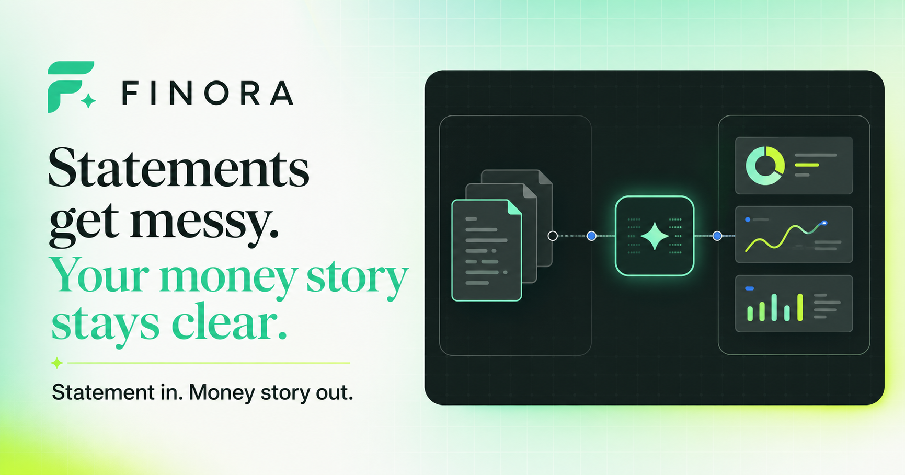
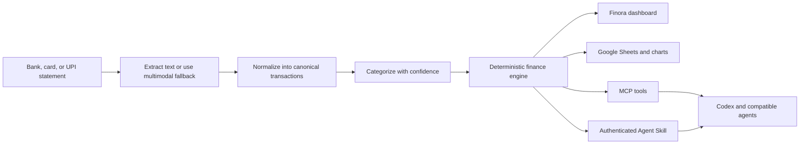
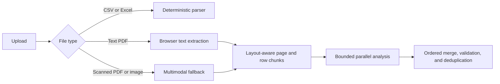
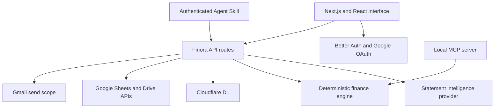

<div align="center">

# Finora

### Every statement tells one money story.

Turn bank, credit-card, and UPI statements into a clean financial memory that works in a dashboard, Google Sheets, Codex, Claude, and other MCP-compatible agents.

[](https://openai.devpost.com/)
[](https://nodejs.org/)
[](./mcp/server.mjs)
[](./skills/finora-finance)
[](https://finora.finora-asr.workers.dev)

[Live app](https://finora.finora-asr.workers.dev) · [Demo](#demo) · [How it works](#how-it-works) · [Run locally](#run-locally) · [MCP and Skill](#mcp-server-and-agent-skill)



*A living product illustration: payment notifications enter Finora, get normalized and explained, and emerge as a useful spending report.*

</div>



## Why we built Finora

Every month, people receive a bank statement. Most of us glance at the balance, notice a few large payments, and close it. The useful details - where the money went, which subscription renewed, whether a merchant charged twice, or how this month compares with the last - stay buried in rows of inconsistent transaction text.

Getting those answers usually means cleaning a spreadsheet, categorizing every payment, and rebuilding the same report again next month. We built Finora because understanding your own money should not require that much maintenance.

Finora starts with the statement you already have and turns it into a ledger you can inspect, correct, question, and use anywhere.

## What Finora is

Finora is a statement-first personal finance application. Upload a PDF, CSV, Excel file, screenshot, credit-card statement, or UPI history and Finora will:

1. extract transactions into one canonical schema;
2. clean noisy merchant names and separate income, consumption, investments, and person-to-person transfers;
3. categorize each transaction with a confidence score and plain-language reason;
4. surface subscriptions, duplicates, anomalies, trends, budgets, forecasts, and monthly insights;
5. make the reviewed ledger available in the dashboard, Google Sheets, and AI agents.

Raw uploads are processed in the request and are not kept. Only the normalized ledger is saved when a signed-in user chooses to persist it.

## Why it is not another expense tracker

| Typical expense tracker | Finora |
| --- | --- |
| Works with a limited list of bank connections | Starts with statements from any bank, card, or UPI app |
| Breaks when columns or narrations change | Normalizes inconsistent tables and messy payment descriptions into one schema |
| Treats every debit as spending | Keeps consumption, investments, and P2P transfers visibly separate |
| Shows category totals | Explains categories, flags uncertainty, and finds subscriptions, duplicates, and anomalies |
| Keeps insights inside one dashboard | Exposes focused MCP tools and an installable Agent Skill |
| Requires manual spreadsheet upkeep | Creates and incrementally refreshes a Google Sheets dashboard with charts |

## Key features

| Area | What is implemented |
| --- | --- |
| Statement intake | PDF, CSV, XLS/XLSX, screenshots, receipt images, bank exports, card statements, and UPI history |
| Large-file pipeline | Text-native PDFs are extracted once, split on page/row boundaries, processed with configurable bounded concurrency, retried by failed section, merged in document order, and deduplicated |
| Explainable ledger | Merchant normalization, categories, confidence scores, reasons, original evidence, and user corrections |
| Financial intelligence | Cash flow, savings rate, fixed/variable and essential/discretionary spending, merchant and category trends, budgets, forecasts, six-month timelines, and health reports |
| Pattern detection | Recurring subscriptions, estimated renewals, annualized cost, possible duplicates, and unusual transactions |
| Ask Finora | Query-aware answers that stay concise for simple facts and add charts, tables, forecasts, timelines, or follow-ups only when they improve the answer |
| Google Sheets | Create or connect a workbook; reconcile new and corrected transactions without duplicating existing rows; refresh summaries and charts |
| Agent access | Local MCP server plus an authenticated Agent Skill for Codex, Claude, and compatible clients |
| Account and data control | Google sign-in, encrypted OAuth tokens, scoped Sheets/Gmail consent, revocable agent tokens, per-user D1 storage, and confirmed full-ledger deletion |

Questions Finora can answer include:

```text
How much did I spend on food this month?
What was my biggest expense last week?
Compare this month with the previous month.
Show every Amazon transaction.
Which subscriptions renewed recently?
Did any merchant charge me twice?
What changed in my finances over the last six months?
```

Finora includes person-to-person transfers and investments in total money movement by default, while showing them separately from consumption. It excludes them only when the user asks.

## How it works



The app uses one transaction contract and one deterministic finance engine across the web app, Sheets exporter, reports, MCP server, and Agent Skill. A correction to the ledger changes every downstream view without maintaining separate copies of the same financial data. Model calls extract unfamiliar formats and explain verified results; they do not invent totals.

### Large statement path



## Architecture



- **Web application:** Next.js/React UI built with Vinext for Cloudflare Workers.
- **Finance engine:** deterministic classifications, summaries, comparisons, subscriptions, duplicates, anomalies, budgets, forecasts, timelines, merchant cleanup, and question-grounded analysis.
- **Statement intelligence:** deterministic tabular parsing first, text-first PDF processing when available, and multimodal normalization for scanned or unfamiliar documents.
- **Persistence:** Cloudflare D1 stores accounts, sessions, normalized ledgers, budgets, chat history, report settings, Sheets connections, and hashed agent tokens.
- **Google integrations:** Better Auth requests `drive.file` and `gmail.send` only when the relevant feature is enabled.
- **Agent surfaces:** a local composable MCP server and a remote authenticated Agent Skill backed by the same Finora API.

## How GPT-5.6 and Codex shaped Finora

We did not use Codex as a one-shot code generator. It was the shared workspace in which we designed, implemented, inspected, tested, and shipped Finora. Our loop looked like this:

1. we described a product problem or shared a screenshot of a broken flow;
2. GPT-5.6 helped us challenge the product and architecture choices;
3. Codex inspected the actual repository, implemented the change across the affected layers, and ran the app;
4. we reviewed the real result, gave concrete feedback, and repeated the loop;
5. Codex ran builds, tests, MCP audits, and live deployment checks before we accepted the change.

That continuity mattered. A change such as "sync only new transactions" was not treated as a UI tweak: Codex traced it through transaction identity, D1 persistence, Sheets reconciliation, tests, and the agent action that triggers the sync.

### Key decisions we made together

| Decision | How GPT-5.6 contributed | How Codex accelerated the work |
| --- | --- | --- |
| Keep finance totals deterministic | Helped define the boundary between model judgment and calculations that must be reproducible | Consolidated calculations into a shared finance engine and added edge-case tests for empty ledgers, transfers, refunds, budgets, and partial months |
| Make the MCP a product surface | Helped replace a monolithic "do everything" call with outcome tools plus precise low-level tools | Implemented and audited 35 composable MCP tools, the authenticated agent API, installable skill, and mutation safeguards |
| Use text-first parsing for large PDFs | Helped identify repeated whole-document model calls as the source of latency and incomplete JSON | Added browser PDF extraction, layout-aware chunks, configurable concurrency, targeted retries, ordered merging, and large-file tests |
| Preserve P2P transfers and investments | Helped frame them as money movement that should remain visible but separate from consumption | Applied the rule consistently in parsing, summaries, questions, charts, MCP results, Sheets, and test fixtures |
| Use narrow Google permissions | Reviewed the risk of broad Drive access and the first-use consent flow | Implemented Better Auth scope linking, encrypted OAuth tokens, native Sheets creation, incremental sync, and disconnect/delete controls |
| Keep Ask Finora modular | Helped distinguish when a direct answer is better than a dashboard and when context materially helps | Built structured response modules that select relevant tables, charts, timelines, forecasts, evidence, and follow-ups by question intent |
| Treat the screenshots as product feedback | Helped turn visual references into clear interaction decisions without copying the reference product | Iterated on the landing page, sticky navigation, dashboard, chat layout, attachment context, and responsive spacing in the running app |

### Where Codex saved the most time

- **Cross-layer implementation:** one task could touch React, API routes, D1, OAuth, Sheets, MCP, and the skill without losing the original intent.
- **Debugging with evidence:** Codex reproduced incomplete JSON, stale Sheet sync, attachment-context, routing, and large-PDF failures before changing code.
- **Verification:** it built the Cloudflare target, exercised every MCP tool against an isolated ledger, checked the installed skill and ZIP, and verified live deployments.
- **Refactoring safely:** it preserved the no-credential CSV path and existing public interfaces while adding higher-level finance intelligence.
- **Design iteration:** screenshot feedback became small, testable changes in the actual interface rather than disconnected mockups.

GPT-5.6 was most valuable when deciding *what Finora should do and why*. Codex was most valuable in turning those decisions into a coherent, tested product and shortening the distance between an idea, a working implementation, and a verified deployment.

## MCP server and Agent Skill

The MCP server is a product surface, not a single "do everything" wrapper. Agents can choose the smallest tool needed and stop before a write.

| Outcome | Recommended tools |
| --- | --- |
| Import an unfamiliar statement end to end | `sync_statement` |
| Understand a period | `analyze_finances`, `answer_finance_question` |
| Explain and forecast | `explain_spending_change`, `predict_month_end_spending`, `financial_timeline` |
| Find realistic savings | `find_savings`, `find_cost_cutting`, `why_is_budget_exceeded`, `suggest_budget` |
| Build a report | `generate_dashboard`, `financial_health_report` |
| Perform precise advanced work | `parse_statement`, `categorize_transactions`, `search_transactions`, `sync_to_sheet`, and focused Sheet range tools |

Run the local MCP server:

```bash
npm run mcp
```

The repository includes [`.codex/config.toml`](./.codex/config.toml), so Codex can discover the server when opened from this project. It can also be registered manually:

```bash
codex mcp add finora -- node mcp/server.mjs
```

### Install the authenticated Finora skill

The [`finora-finance`](./skills/finora-finance) skill connects an agent to the user's cloud Finora account. On first use it returns a short-lived browser link. Google sign-in happens on Finora's domain; the skill receives a revocable Finora token, never the user's Google credentials.

```bash
npx skills add AdarshSingh-ASR/Finora --skill finora-finance --global --yes
```

This installs Finora at user level and uses the production service automatically. The downloadable ZIP remains available; after extraction, run `node finora-finance/scripts/install.mjs`. Pass a URL only when using a self-hosted Finora deployment.

Invoke it in Codex:

```text
$finora-finance skill-sync
```

Or through the included Claude command:

```text
/finance skill-sync
```

After pairing, users can import statements, ask questions, inspect patterns, correct categories, manage budgets, sync Sheets, and configure reports directly from the agent. See the [Skill instructions](./skills/finora-finance/SKILL.md) and [agent API reference](./skills/finora-finance/references/api.md).

## Google Sheets integration

Finora uses the signed-in user's Google connection. It does not require an Apps Script URL, shared secret, or service account for Sheets access.

On first sync, the user grants the narrow `drive.file` scope. Finora can then create a **Finora Financial Dashboard** or update a workbook the user explicitly connected. The workbook contains:

- Transactions
- Monthly Summary
- Category Summary
- Merchant Summary
- Subscriptions
- Insights
- Financial Timeline
- Forecast & Savings
- Charts

Future syncs reconcile transaction identities: unchanged rows stay in place, corrected rows are updated, and only genuinely new transactions are appended before the analytical tabs and charts refresh.

## Run locally

### Prerequisites

- Node.js 22.13 or newer
- npm
- A Google Cloud project for web sign-in and optional Gmail/Sheets features
- A Cloudflare account and Wrangler login for D1-backed web sessions

### 1. Clone and install

```bash
git clone https://github.com/AdarshSingh-ASR/Finora.git
cd Finora
npm install
```

### 2. Create the environment file

macOS/Linux:

```bash
cp .env.example .env
```

PowerShell:

```powershell
Copy-Item .env.example .env
```

Required for the signed-in web app:

```env
BETTER_AUTH_SECRET=generate-a-long-random-secret
BETTER_AUTH_URL=http://localhost:3000
GOOGLE_CLIENT_ID=your-google-oauth-client-id
GOOGLE_CLIENT_SECRET=your-google-oauth-client-secret
CRON_SECRET=generate-another-long-random-secret
```

Optional statement-intelligence settings:

| Variable | Purpose | Default |
| --- | --- | --- |
| `GOOGLE_VERTEX_CREDENTIALS` | Enables model-assisted PDF, image, and unfamiliar-layout normalization | empty |
| `GOOGLE_VERTEX_LOCATION` | Vertex region | `global` |
| `GOOGLE_VERTEX_MODEL` | Configured statement model | see [`.env.example`](./.env.example) |
| `GROQ_API_KEY` | Text fallback credential | empty |
| `GROQ_MODEL` | Text fallback model | see [`.env.example`](./.env.example) |
| `MAX_CONCURRENT_CHUNKS` | Parallel text-PDF sections, clamped from 1 to 8 | `3` |
| `FINORA_DATA_DIR` | Local MCP ledger directory | `.finora` |

Generate secure local secrets with:

```bash
node -e "console.log(require('crypto').randomBytes(32).toString('base64url'))"
```

### 3. Configure Google OAuth

In [Google Cloud Console](https://console.cloud.google.com/):

1. configure the OAuth consent screen and add your test accounts;
2. enable Gmail, Google Sheets, and Google Drive APIs;
3. add `http://localhost:3000` as an authorized JavaScript origin;
4. add `http://localhost:3000/api/auth/callback/google` as an authorized redirect URI;
5. add `https://www.googleapis.com/auth/gmail.send` and `https://www.googleapis.com/auth/drive.file` under Data Access.

The Gmail and Drive permissions are requested only when a user enables reports or Sheets sync.

### 4. Prepare D1 and start the app

The checked-in `wrangler.jsonc` points to the project database. Forks should create their own D1 database and replace the binding ID before running migrations.

```bash
npx wrangler login
npm run db:migrate:local
npm run dev
```

Open [http://localhost:3000](http://localhost:3000), sign in with a configured Google test account, and upload [`samples/upi-statement.csv`](./samples/upi-statement.csv). The dashboard starts empty and populates only from transactions Finora actually finds.

## Sample data and credential-free verification

[`samples/upi-statement.csv`](./samples/upi-statement.csv) is a small, redacted UPI-style statement committed for local testing and hackathon review. It exercises merchant cleanup, debit/credit direction, category separation, and the no-AI CSV parser. It contains no real account identifiers.

The CSV parser and local MCP analytics do not need an AI credential. To inspect that path:

```bash
npm install
npm run mcp:inspect
```

In the MCP Inspector, call `parse_statement` with the absolute path to `samples/upi-statement.csv`, then pass the returned rows to `categorize_transactions` and `summarize_transactions`. Saving and syncing are separate tools, so this verification does not modify a ledger or Sheet unless you explicitly call a write tool.

Run the complete automated verification with:

```bash
npm test
```

This builds the Cloudflare target and checks finance calculations, providers, MCP composition, large-statement chunking, and incremental Sheets reconciliation.

### Useful commands

| Command | Purpose |
| --- | --- |
| `npm run dev` | Start the local app |
| `npm run build` | Build the Cloudflare/Vinext application |
| `npm test` | Build and run the automated checks |
| `npm run lint` | Run ESLint |
| `npm run mcp` | Start the Finora MCP server |
| `npm run mcp:inspect` | Open the MCP Inspector |
| `npm run db:migrate:local` | Apply D1 migrations locally |

### Common setup checks

- If Google sign-in redirects incorrectly, confirm `BETTER_AUTH_URL` and the Google callback URI use the same origin.
- If PDF or image extraction is unavailable, verify `GOOGLE_VERTEX_CREDENTIALS`; the sample CSV path should still work.
- If a large text PDF is throttled, lower `MAX_CONCURRENT_CHUNKS` without changing code.
- If Sheets asks for access, reconnect from Finora so Google can grant `drive.file` to the current account.

## Deployment

Finora targets Cloudflare Workers and D1.

1. create a D1 database and place its ID in [`wrangler.jsonc`](./wrangler.jsonc), or use the existing binding if you own the project;
2. add production secrets to Cloudflare;
3. set `BETTER_AUTH_URL` to the production origin;
4. add the production Google OAuth origin and callback;
5. apply the D1 migrations remotely;
6. build and deploy with Vinext.

```bash
npx wrangler login
npx wrangler d1 migrations apply DB --remote
npm run build
npx vinext deploy
```

After deployment, verify the printed Worker URL, Google sign-in, one sample import, Ask Finora, and a Sheet sync using a test account.

## Demo

> **Live demo:** [https://finora.finora-asr.workers.dev](https://finora.finora-asr.workers.dev)

> **Demo video:** add the public YouTube link here. The final video should stay under three minutes, show the working product, and explain where GPT-5.6 and Codex changed the outcome.

Suggested judge walkthrough:

1. Upload the redacted sample statement.
2. Show merchant cleanup, categories, confidence, and transfer separation.
3. Open subscriptions, duplicates, anomalies, and a month comparison.
4. Ask one concise factual question and one richer analytical question to demonstrate modular responses.
5. Sync the ledger to Google Sheets and open the generated charts.
6. Run `$finora-finance skill-sync` in Codex and ask for the same result through the skill.
7. Import another statement and resync Sheets to demonstrate identity-based incremental reconciliation.

### Screenshots and GIFs

The repository includes the social preview above. Add the final production captures under `public/demo/` before submission:

- `[Landing page GIF - statement to ledger to report]`
- `[Dashboard screenshot - overview and trends]`
- `[Ask Finora screenshot - natural-language analysis]`
- `[Google Sheets screenshot - generated tabs and charts]`
- `[Codex screenshot - Finora skill in use]`

## Project structure

```text
Finora/
|-- app/                     # Landing page, dashboard, auth, and API routes
|   `-- api/
|       |-- agent/           # Authenticated skill API
|       |-- agent-auth/      # Short-lived account pairing flow
|       |-- categorize/      # Statement extraction and categorization
|       |-- reports/         # Scheduled reports
|       `-- sheets/          # Native Google Sheets actions
|-- components/              # Reusable UI components
|-- db/                      # D1 schema and database access
|-- drizzle/                 # Versioned D1 migrations
|-- lib/                     # Finance, parsing, auth, AI, Sheets, and email logic
|-- mcp/                     # Composable MCP server
|-- samples/                 # Redacted judge-friendly sample data
|-- skills/
|   |-- finora-finance/      # Installable authenticated Agent Skill
|   `-- finora-money/        # Local MCP workflow skill
|-- tests/                   # Finance, parsing, Sheets, MCP, provider, and build tests
`-- worker/                  # Cloudflare Worker and report scheduler
```

## Privacy and safety

- Raw statements are processed in-request and are not stored.
- Statement contents, account identifiers, API keys, and OAuth tokens are never logged.
- Better Auth encrypts Google access and refresh tokens in D1.
- Agent access tokens are stored as hashes and can be revoked.
- The Agent Skill never receives the user's Google password or OAuth token.
- Confidence and explanations remain visible so uncertain classifications can be reviewed.
- Finora provides factual ledger analysis, not investment, tax, legal, or credit advice.

## Future improvements

- password-protected statement PDFs;
- page-level OCR review and manual rescue for genuinely unreadable scans;
- persistent user-defined merchant and category rules;
- bank/email ingestion with explicit narrow permissions;
- shared household ledgers and role-based access;
- mobile receipt capture and offline review;
- rate limiting and a token-management screen before broad public release;
- additional export destinations beyond Google Sheets.

## Contributing

Issues and focused pull requests are welcome. Keep financial data out of fixtures and logs, preserve the no-credential CSV path, and run:

```bash
npm test
npm run lint
```

## License

A license file will be added before public distribution. Until then, the repository is available for hackathon judging and review; no additional rights are granted.
