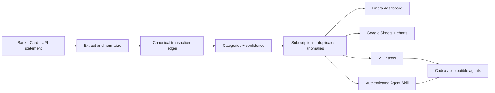
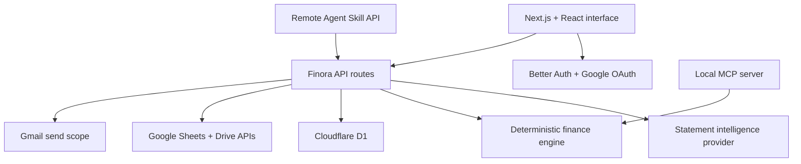

<div align="center">

# Finora

### Every statement tells one money story.

Turn bank, credit-card, and UPI statements into a clean financial memory that works in a dashboard, Google Sheets, Codex, Claude, and other MCP-compatible agents.

[](https://openai.devpost.com/)
[](https://nodejs.org/)
[](./mcp/server.mjs)
[](./skills/finora-finance)
[](https://finora.finora-asr.workers.dev)

[Live app](https://finora.finora-asr.workers.dev) · [Demo](#demo) · [How it works](#how-it-works) · [Run locally](#run-locally) · [MCP and Skill](#mcp-server-and-agent-skill)

</div>


## Why we built Finora

Every month, people receive a bank statement. Most of us glance at the balance, notice a few large payments, and close it. The useful details—where the money went, which subscription renewed, whether a merchant charged twice, or how this month compares with the last—stay buried in rows of inconsistent transaction text.

Getting those answers usually means cleaning a spreadsheet, categorizing every payment, and rebuilding the same report again next month. We built Finora because understanding your own money should not require that much maintenance.

Finora starts with the statement you already have and turns it into a ledger you can inspect, correct, ask questions about, and use anywhere.

## What Finora is

Finora is a statement-first personal finance application. Upload a PDF, CSV, Excel file, screenshot, credit-card statement, or UPI history and Finora will:

1. extract the transactions into one canonical schema;
2. clean noisy merchant names and separate income, consumption, investments, and person-to-person transfers;
3. categorize each transaction with a confidence score and plain-language reason;
4. surface subscriptions, duplicates, anomalies, trends, budgets, and monthly insights;
5. make the resulting ledger available in the dashboard, Google Sheets, and AI agents.

Raw uploads are processed in the request and are not kept. Only the normalized ledger is saved when a signed-in user chooses to persist it.

## Why it is not another expense tracker

| Typical expense tracker | Finora |
| --- | --- |
| Works with a limited list of bank connections | Starts with statements from any bank, card, or UPI app |
| Breaks when columns or narrations change | Normalizes inconsistent tables and messy payment descriptions into one schema |
| Treats every debit as spending | Keeps consumption, investments, and P2P transfers visibly separate |
| Shows category totals | Explains categories, flags uncertainty, and finds subscriptions, duplicates, and anomalies |
| Keeps insights inside one dashboard | Exposes focused MCP tools and an installable Agent Skill |
| Requires manual spreadsheet upkeep | Creates and refreshes a structured Google Sheets dashboard with charts |

## Key features

| Area | What is implemented |
| --- | --- |
| Statement intake | PDF, CSV, XLS/XLSX, screenshots, receipt images, bank exports, card statements, and UPI history; large AI-read documents are adaptively split into verified transaction ranges |
| Explainable ledger | Merchant normalization, categories, confidence scores, reasons, and user corrections |
| Financial intelligence | Cash flow, savings rate, fixed/variable and essential/discretionary spending, category and merchant trends, budgets, forecasts, six-month timelines, and financial-health reports |
| Pattern detection | Recurring subscriptions, estimated renewals, annualized cost, possible duplicates, and unusual transactions |
| Ask Finora | Query-aware responses that stay concise for factual lookups and add relevant charts, tables, forecasts, timelines, or follow-ups only when they improve the answer |
| Google Sheets | Create or connect a workbook; incrementally reconcile new or corrected transactions without duplicating existing rows, then refresh summaries and charts |
| Agent access | Local MCP server plus an authenticated Agent Skill for Codex, Claude, and compatible clients |
| Account and data control | Google sign-in, encrypted OAuth tokens, scoped Sheets/Gmail consent, revocable agent tokens, per-user D1 storage, and confirmed full-ledger deletion |

Examples of questions Finora can answer:

```text
How much did I spend on food this month?
What was my biggest expense last week?
Compare this month with the previous month.
Show every Amazon transaction.
Which subscriptions renewed recently?
Did any merchant charge me twice?
How much did I spend on travel this year?
```

Finora includes person-to-person transfers and investments in total money movement by default, while showing them separately from consumption. It excludes them only when the user asks.

## How it works



The app uses a structured transaction contract and one deterministic finance engine throughout the web app, Sheets exporter, reports, MCP server, and Agent Skill. A correction made to the ledger therefore changes every downstream view without maintaining separate copies of the same financial data. Model calls extract unfamiliar source formats and explain verified results; they do not invent totals.

## Architecture



### Main components

- **Web application:** Next.js/React UI built with Vinext for Cloudflare Workers.
- **Finance engine:** deterministic cash-flow classifications, summaries, comparisons, subscriptions, duplicates, anomalies, budgets, forecasts, financial timelines, merchant cleanup, and question-grounded analysis.
- **Statement intelligence:** multimodal normalization for unfamiliar documents, adaptive range splitting for large statements, and a deterministic CSV path that works without an AI credential.
- **Persistence:** Cloudflare D1 stores accounts, sessions, normalized ledgers, budgets, chat history, report settings, Sheets connections, and hashed agent tokens.
- **Google integrations:** Better Auth requests `drive.file` and `gmail.send` only when the relevant feature is enabled.
- **Agent surfaces:** a local composable MCP server and a remote, authenticated Agent Skill backed by Finora's API.

## MCP server and Agent Skill

The MCP server is a product surface, not a single “do everything” wrapper. Agents can choose the smallest tool needed and stop before a write.

| Outcome | Recommended MCP tools |
| --- | --- |
| Import an unfamiliar statement end to end | `sync_statement` |
| Understand a period | `analyze_finances`, `answer_finance_question` |
| Explain and forecast | `explain_spending_change`, `predict_month_end_spending`, `financial_timeline` |
| Find realistic savings | `find_savings`, `find_cost_cutting`, `why_is_budget_exceeded`, `suggest_budget` |
| Build a report | `generate_dashboard`, `financial_health_report` |
| Precise advanced work | `parse_statement`, `categorize_transactions`, `search_transactions`, `sync_to_sheet`, and focused Sheet range tools |

Run the local MCP server:

```bash
npm run mcp
```

The repository includes [`.codex/config.toml`](./.codex/config.toml), so Codex can discover the server when opened from this project. It can also be registered manually:

```bash
codex mcp add finora -- node mcp/server.mjs
```

### Install the authenticated Finora skill

The [`finora-finance`](./skills/finora-finance) skill connects an agent to the user's cloud Finora account. On first use it returns a short-lived browser link. Google sign-in happens on Finora's domain; the skill receives a revocable Finora token, never the user's Google credentials.

```bash
node skills/finora-finance/scripts/install.mjs https://your-finora-domain.example
```

Invoke it in Codex:

```text
$finora-finance skill-sync
```

Or through the included Claude command:

```text
/finance skill-sync
```

After pairing, users can import statements, ask questions, inspect patterns, correct categories, manage budgets, sync Sheets, and configure reports directly from the agent. See the [Skill instructions](./skills/finora-finance/SKILL.md) and [agent API reference](./skills/finora-finance/references/api.md).

## Google Sheets integration

Finora uses the signed-in user's Google connection. It does not require an Apps Script URL, shared secret, or service account for Sheets access.

On the first sync, the user grants the narrow `drive.file` scope. Finora can then create a **Finora Financial Dashboard** or update a workbook the user explicitly connected. The workbook contains:

- Transactions
- Monthly Summary
- Category Summary
- Merchant Summary
- Subscriptions
- Insights
- Financial Timeline
- Forecast & Savings
- Charts

Users can open, resync, rename, copy, move, share, disconnect, or delete the workbook from Finora. Future syncs reconcile transaction identities: unchanged rows stay in place, corrected rows are updated, and only genuinely new transactions are appended before the analytical tabs and charts refresh.

## Built with Codex and GPT-5.6

Finora was built during [OpenAI Build Week](https://openai.devpost.com/) for the **Apps for Your Life** track. Codex and GPT-5.6 were part of the development loop from the first architecture sketch to the final verification pass.

### Codex

We used Codex throughout the repository, not only for isolated code generation. It helped us:

- implement and refactor the statement pipeline, dashboard, authentication, Google integrations, MCP server, and Agent Skill;
- trace bugs across UI state, API routes, D1 persistence, OAuth scopes, and generated Sheets;
- turn product feedback and screenshots into precise interaction and layout changes;
- write migrations, tests, validation scripts, and reproducible setup instructions;
- run builds and inspect the real application after changes instead of stopping at code suggestions.

The largest acceleration came from keeping design, implementation, debugging, and verification in one continuous Codex workflow. That made it practical to iterate on the complete product rather than optimize one disconnected prototype.

### GPT-5.6

GPT-5.6 was used as our architecture and product-design partner inside that workflow. We used it for:

- deciding where deterministic finance logic should end and model-based normalization should begin;
- designing focused MCP tools and the authenticated skill flow;
- reviewing privacy boundaries around raw statements, Google OAuth, and agent tokens;
- improving categorization and finance-question prompts around transfers, uncertainty, and evidence;
- reviewing code and product flows for failure cases before the final implementation pass.

Supporting services handle statement inference and deployment, but Codex and GPT-5.6 shaped how Finora was designed, built, reviewed, and shipped.

## Run locally

### Prerequisites

- Node.js 22.13 or newer
- npm
- A Google Cloud project for sign-in and optional Gmail/Sheets features
- Cloudflare Wrangler for the local D1 database

### 1. Clone and install

```bash
git clone https://github.com/AdarshSingh-ASR/Finora.git
cd Finora
npm install
```

### 2. Create the environment file

macOS/Linux:

```bash
cp .env.example .env
```

PowerShell:

```powershell
Copy-Item .env.example .env
```

Minimum account configuration:

```env
BETTER_AUTH_SECRET=generate-a-long-random-secret
BETTER_AUTH_URL=http://localhost:3000
GOOGLE_CLIENT_ID=your-google-oauth-client-id
GOOGLE_CLIENT_SECRET=your-google-oauth-client-secret
CRON_SECRET=generate-another-long-random-secret
```

Optional statement-intelligence configuration is documented in [`.env.example`](./.env.example). Without it, judges can still test the deterministic CSV parser using [`samples/upi-statement.csv`](./samples/upi-statement.csv).

Text-native PDFs are extracted once in the browser and analyzed in independent sections. Set `MAX_CONCURRENT_CHUNKS=3` to tune the bounded parallelism for your provider; accepted values are `1` through `8`.

Generate secure local secrets with:

```bash
node -e "console.log(require('crypto').randomBytes(32).toString('base64url'))"
```

### 3. Configure Google OAuth

In [Google Cloud Console](https://console.cloud.google.com/):

1. configure the OAuth consent screen and add your test accounts;
2. enable Gmail, Google Sheets, and Google Drive APIs;
3. add `http://localhost:3000` as an authorized JavaScript origin;
4. add `http://localhost:3000/api/auth/callback/google` as an authorized redirect URI;
5. add `https://www.googleapis.com/auth/gmail.send` and `https://www.googleapis.com/auth/drive.file` under Data Access.

The Gmail and Drive permissions are requested only when a user enables reports or Sheets sync.

### 4. Prepare D1 and start the app

```bash
npm run db:migrate:local
npm run dev
```

Open the URL printed by the development server. Sign in, upload [`samples/upi-statement.csv`](./samples/upi-statement.csv), and the dashboard will populate with real results from that file—there is no seeded dashboard data.

### Useful commands

| Command | Purpose |
| --- | --- |
| `npm run dev` | Start the local app |
| `npm run build` | Build the Cloudflare/Vinext application |
| `npm test` | Build and run the automated checks |
| `npm run lint` | Run ESLint |
| `npm run mcp` | Start the Finora MCP server |
| `npm run mcp:inspect` | Open the MCP inspector |
| `npm run db:migrate:local` | Apply D1 migrations locally |

## Deployment

Finora currently targets Cloudflare Workers and D1. Before deploying:

1. replace the placeholder D1 database ID in [`wrangler.jsonc`](./wrangler.jsonc);
2. add production secrets to Cloudflare;
3. set `BETTER_AUTH_URL` to the production origin;
4. add the production Google OAuth origin and callback;
5. apply the D1 migrations remotely.

```bash
npx wrangler login
npx wrangler d1 migrations apply DB --remote
npm run build
```

## Demo

> **Live demo:** [https://finora.finora-asr.workers.dev](https://finora.finora-asr.workers.dev)

> **Demo video:** add the public YouTube link here. OpenAI Build Week requires a video under three minutes showing the working project and explaining how Codex and GPT-5.6 were used.

Suggested judge walkthrough:

1. Upload the redacted sample statement.
2. Show merchant cleanup, categories, confidence, and transfer separation.
3. Open subscriptions, duplicates, anomalies, and the month comparison.
4. Ask Finora a natural-language question and inspect the supporting transactions.
5. Sync the ledger to Google Sheets and open the generated charts.
6. Run `$finora-finance skill-sync` in Codex and ask for the same result through the skill.
7. Import another statement and resync Sheets to show identity-based incremental reconciliation.

### Screenshots and GIFs

The repository already includes the social preview above. Add the final production captures here before submission:

<!-- Replace these placeholders with compressed assets under public/demo/. -->

- `[Landing page GIF — statement → ledger → report]`
- `[Dashboard screenshot — overview and trends]`
- `[Ask Finora screenshot — natural-language answer]`
- `[Google Sheets screenshot — generated tabs and charts]`
- `[Codex screenshot — Finora skill in use]`

## Project structure

```text
Finora/
├── app/                     # Landing page, dashboard, auth, and API routes
│   └── api/
│       ├── agent/           # Authenticated skill API
│       ├── agent-auth/      # Short-lived account pairing flow
│       ├── categorize/      # Statement extraction and categorization
│       ├── reports/         # Scheduled AI reports
│       └── sheets/          # Native Google Sheets actions
├── components/              # Reusable UI components
├── db/                      # D1 schema and database access
├── drizzle/                 # Versioned D1 migrations
├── lib/                     # Finance engine, adaptive statement parsing, auth, AI, Sheets, and email logic
├── mcp/                     # Composable MCP server
├── samples/                 # Judge-friendly sample statements
├── skills/
│   ├── finora-finance/      # Installable authenticated Agent Skill
│   └── finora-money/        # Local MCP workflow skill
├── tests/                   # Build, finance, statement chunking, Sheets, MCP, and provider tests
└── worker/                  # Cloudflare Worker and report scheduler
```

## Privacy and safety

- Raw statements are processed in-request and are not stored.
- Statement contents, account identifiers, API keys, and OAuth tokens are never logged.
- Better Auth encrypts Google access and refresh tokens in D1.
- Agent access tokens are stored as hashes and can be revoked.
- The Agent Skill never receives the user's Google password or OAuth token.
- Confidence and explanations remain visible so uncertain classifications can be reviewed.
- Finora provides factual ledger analysis, not investment, tax, legal, or credit advice.

## Future improvements

- password-protected statement PDFs;
- page-level OCR review and manual rescue for genuinely unreadable scans;
- user-defined merchant and category rules that persist across imports;
- bank/email ingestion with explicit, narrow permissions;
- shared household ledgers and role-based access;
- mobile receipt capture and offline review;
- rate limiting and a token-management screen before broad public release;
- additional export destinations beyond Google Sheets.

## Contributing

Issues and focused pull requests are welcome. Please keep financial data out of fixtures and logs, preserve the no-credential CSV path, and run the following before opening a PR:

```bash
npm test
npm run lint
```

## License

A license file will be added before public distribution. Until then, the repository is available for hackathon judging and review; no additional rights are granted.
